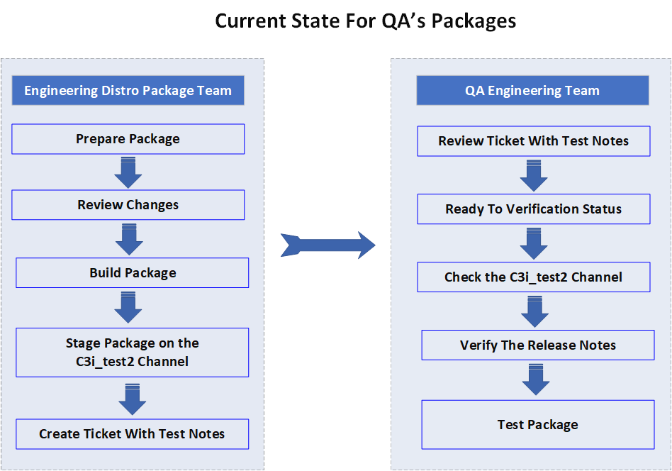

# Document Current and Proposed Future State for How Distro QA's Packages

# Acceptance Criteria
---
Document how we validate package builds today prior to them going to defaults. Document recommended process for the near term future (Distro Confluence).
---

# Document Current State for How Distro QA's Packages

* Prepare Package
* Review Changes
* Build Package
* Create Tickets in `jira`.
* Add test notes in the jira ticket
* Move the ticket to `Ready for verificaiton` status.
* Upload the package to the c3i_test2

## Prepare Package

The Engineering Distro Package team will prepare the package that will be used.

## Review Changes

The changes will be reviewed in order to ensure that the package will be build properly

## Build Package

The package must be created after all of the changes are completed in order to test them and deploy them. 

## Create Tickets in `jira` 

The Engineering Distro Package team will create the ticket for the package after creating the package.

## Add test notes in the jira ticket

The Engineering Distro Package team will add additional notes as needed in the jira ticket for testing purposes. 

## Move the ticket to `Ready for verification` status.

The ticket will be placed on the ready for verification section. 

## Upload the package to the c3i_test2

The package will be uploaded to the C3i_test2 channel in order to have a place where the packages can be downloaded and tested. 

## Review Ticket With Test Notes

The QA team will open the ticket and will read and investigate the details regarding the package and how to test them. 

## Test Package
 
The package will be tested, and a report will be made of any additional issues or changes required. 

# Document Future State for How Distro QA's Packages

... To Be Determined ...
